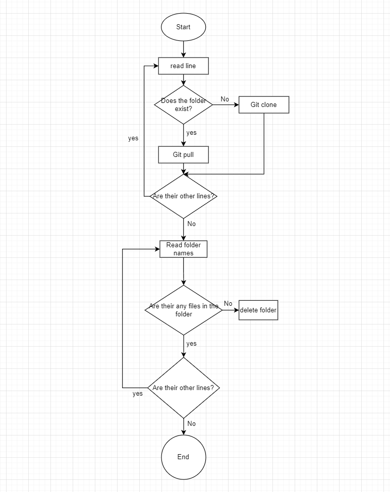
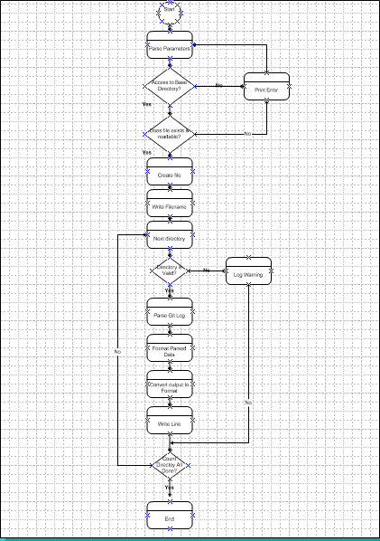

# Projekt Dokumentation

[[_TOC_]]

## Lösungsdesign
Anhand der Analyse wurde folgendes Lösungsdesign entworfen.

### Aufruf der Skripte

TODO: schreiben sie wie die Skripte aufgerufen werden sollen (d.h. welche Parameter werden übergeben, gibt es Interaktionen mit dem Skript, läuft es automatisch täglich ab?)

### Ablauf der Automation

Activity Diagramm von Script 1: 

Activity Diagramm von Script 2: 

### Konfigurationsdateien

TODO: Definieren sie welche Parameter in welchen Konfigurationsdateien gespeichert werden.

## Abgrenzungen zum Lösungsdesign

TODO: Nachdem das Programm verwirklicht wurde hier die unterschiede von der Implemenatino zum Lösungsdesign beschreiben (was wurde anders gemacht, was wurde nicht gemacht, was wurde zusaetzlich gemacht)